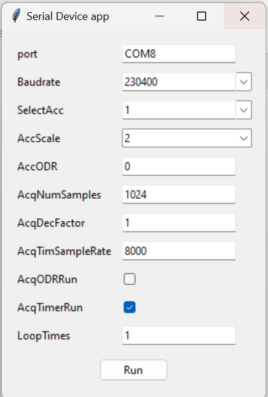

# Serial Device Application
 
## Overview
 
This repository contains a Python-based application designed for communication with devices containing serial communication. The application supports both embedded and desktop modes, allowing users to interact with the embeded devices through a graphical user interface (GUI) or command-line interface (CLI).
 
## Components
 
### Main Application (`start.py`)
 
The entry point of the application. It parses command-line arguments to determine the mode (embedded or desktop) and initializes the appropriate application components.
 
### Accelerometer Test Application (`AccTestApp.py`)
 
Handles the core functionality for data acquisition in embedded mode. It initializes the Serial Device, runs data acquisition, and saves the acquired data.
 
### Desktop Application (`DesktopApp.py`)
 
Provides a GUI for configuring and running the data acquisition process. Users can set various parameters and start the acquisition process through the interface.


 
### Accelerometer Controller (`AccController.py`)
 
Manages the communication with the Serial Device, including initialization, data acquisition, and data download.
 
### Device Protocol (`DeviceProtocol.py`)
 
Defines the protocol for communicating with the Serial Device device over a serial connection.
 
### Serial Device (`SerialDevice.py`)
 
Handles the low-level serial communication with the Serial Device device.
 
## Usage
 
### Embedded Mode
 
Run the application in embedded mode using the following command:
 
```bash
python start.py --port COM8 --baudrate 230400 --selectacc 1 --accscale 1 --acqnumsamples 8192 --acqdecfactor 1 --acqtimsamplerate 8000
```
 
### Desktop Mode
 
Run the application in desktop mode using the following command:
 
```bash
python start.py --desktop
```
 
This will launch the GUI, allowing you to configure the parameters and start the data acquisition process.
 
## Dependencies
 
- Python 3.x
- `tkinter` for GUI
- `scipy` for data processing
 
